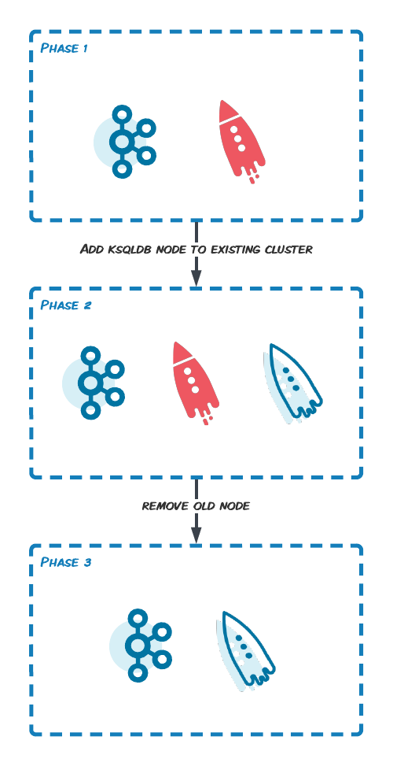

# ksqldb cluster scale up demo

## Requirements

- Docker
- [Confluent Binaries]("https://docs.confluent.io/platform/current/installation/installing_cp/zip-tar.html#get-the-software")

## Overview

Demo built to simulate a migration from ksqldb community to cp ksql. 
The idea is to scale the cluster with new cp ksql nodes and stop/remove community nodes. 
While scaling with new nodes it's important to use the same `ksql.service.id` and the same `bootstrap.servers`. With those settings they will share the workload.

